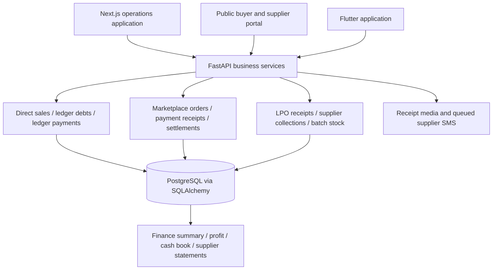

# Omoterra financial architecture and decision-readiness audit

Review date: 2 October 2026. Review began 1 October; principal findings rechecked against commit `5aa01a9` on 2 October. Scope: repository architecture, financial calculations, inventory-to-sale costing, payments, corrections, reporting and planning. This is a code-based assessment, not certification of production balances. No live financial records, bank statements or deployment settings were inspected or changed.

## Executive assessment

Omoterra has a useful operational subledger: it records sales, supplier invoices, installments, expenses, receipts and physical collections. However, its current reports should be treated as **provisional management figures**, not complete reconciled business accounts. The largest risks are inconsistent coverage across dashboards, missing costs treated as zero, and correction workflows that change costs or apparent cash without representing the underlying economic event.

The priority is to make actuals trustworthy before adding projections. A polished forecast built on incomplete cash balances and inflated margins would amplify existing errors.

Recommended sequence:

1. Fix report scope, cost completeness and correction semantics; validate receipt units and dates.
2. Reconcile money by actual cash/bank/mobile-money account and inventory by received lot.
3. Introduce auditable adjustments, accounting classifications and period close.
4. Build a 13-week cash forecast and 12-month operating plan from reconciled actuals.

The accompanying [implementation backlog](financial-improvement-backlog.csv) contains priorities, dependencies and acceptance criteria. P0 means correct before relying on the affected measure for decisions; P1 means required for dependable financial management; P2 means operational hardening and scale. These priorities describe exposure, not evidence that a specific production balance is wrong.

## Architecture and existing strengths



The main architectural weakness is that separate transaction families feed different subsets of the reporting layer. A shared database alone does not make the reports economically consistent.

| Area | Evidence and role |
| --- | --- |
| Transaction boundaries | [db.py](../backend/app/db.py), [services.py](../backend/app/services.py): session transactions, idempotency replay with payload fingerprints and a commerce advisory lock |
| Financial ledger | [finance.py](../backend/app/finance.py): direct sales, installments, supplier payment allocations, expenses and aggregate reports |
| Marketplace money | [main.py](../backend/app/main.py): buyer reconciliation, settlement payment and supplier confirmation |
| Physical stock | [batch_stock.py](../backend/app/batch_stock.py), [purchasing.py](../backend/app/purchasing.py): collection notes and LPO stock consumption |
| Data contracts | [contracts.py](../backend/app/contracts.py), [models.py](../backend/app/models.py): Decimal money, numeric database columns, checks and foreign keys |
| Staff interface | [ops API client](../ops/lib/api.ts), [session handling](../ops/lib/session.ts): server-side API access and operator sessions |
| Payment communications | [supplier_payment_sms.py](../backend/app/supplier_payment_sms.py): queued receipt messages, distinct from bank confirmation |

Useful safeguards already exist: transactional writes, stock availability checks, idempotent operations, supplier ownership checks, role restrictions on reversals, payment evidence requirements, and reason-bearing reversals. Receiving stock creates a payable once; selling received stock carries its cost without intentionally creating another payable. Preserve these foundations.

The global commerce lock mitigates many concurrent mutation risks. This audit does **not** assert that payment writes lack concurrency protection. Any future lock optimization must retain consistency and test sale-edit lock ordering.

## How much can current reports be trusted?

| Measure | Current limitation | Decision implication |
| --- | --- | --- |
| Individual ledger invoice balance | Depends on correct source, allocations and corrections | Useful after document reconciliation |
| Business receivables/payables | Overview mixes streams; drilldowns do not cover the same population | Do not assume visible party lists explain the headline |
| Cash in hand | All-time ledger cash receipts less payments; no opening balance or cash count | Not a verified available-to-spend balance |
| Gross/net profit | Missing costs become zero; incomplete classifications and period recognition | Provisional operating result, not full net income |
| Supplier payment history | Transfer header and reversed allocations can disagree | Confirm actual money sent before paying again |
| Inventory availability/value | Receipt paths differ; collection losses/returns and unit validation incomplete | Physical counts and receipt reconciliation remain necessary |
| Historical trends | Current record state can rewrite earlier periods | Not a closed-period financial history |
| Forecast | No versioned financial planning engine identified | No defensible system-generated projection yet |

## Findings and proposed remedies

### F01 — P0: report populations are inconsistent

**Confirmed in code.** `finance_summary` adds marketplace `Payment` balances and pending `Settlement` amounts to headline debts. Its debtor/creditor lists and trends use the ledger. `_cash_totals`, `_paid` and payment-method totals use `LedgerPayment`; marketplace receipts and settlement payments are excluded. Sales cards use `Sale`, whereas `profit_between` also includes delivered marketplace orders. Marketplace balances can include orders not yet delivered.

**Effect:** headline, drilldown, sales and profit reports cannot necessarily reconcile. Commitments can be confused with recognized debts.

**Change:** publish one metric contract defining source population, recognition event, date basis, status and exclusions. Build common reporting views across both streams with source identifiers and double-count protection. Show commitments separately. Test every headline against its complete drilldown, including marketplace-only activity.

### F02 — P0: unknown buying costs become zero

**Confirmed.** `create_sale` and `update_sale` compute `cost_amount` using `item.cost_total or ZERO`. Optional cost inputs and the own-stock route allow missing acquisition cost. Previously paid stock still has a cost when sold; paying its supplier earlier does not make its margin equal to revenue.

**Change:** distinguish known zero cost, unknown cost and known carrying cost. Add opening inventory and already-paid purchased stock with value, without creating a new payable. Show uncosted sales and provisional margins; require explicit completion or approval before closing a period. Backfill only against evidence, retaining unknown values where evidence is absent.

### F03 — P0: receipt quantities are not tied to their source unit/date

**Confirmed validation gap.** Received-stock branches retain caller-supplied `unit` and category while `take_collection_stock`/`take_stock` check numeric availability. A receipt measured in birds must not be consumed as arbitrary kilograms. Availability checks are current-state checks, not stock availability as of the sale date.

**Change:** derive category/unit from the receipt, or require a documented conversion with weight/yield. Validate sale timing against receipt and historical availability; provide an explicit approved adjustment route for late entry. Test fractional birds, wrong units and backdated stock consumption. An advance payment before a sale is valid when classified as an advance; do not prohibit all earlier payment dates.

### F04 — P0: allocation reversal is conflated with reversing money

**Confirmed.** `pay_supplier` creates a `SupplierPayment` transfer header and `LedgerPayment` allocations. `reverse_payment` reverses an allocation and reduces debt paid amount, but leaves the transfer header unchanged. Cash reports omit reversed allocations, although the supplier may still hold the money. The header has no corresponding refund/transfer-reversal lifecycle.

**Change:** separate actual transfers, allocation changes, unapplied supplier credits and actual refunds. Moving a payment to the correct invoice must leave cash unchanged. A genuine refund must be a new dated inflow. Supplier statements must explain transferred, allocated, refunded and unallocated balances. A recording error must not silently imply the supplier owes money or authorize paying twice.

### F05 — P0: available cash is not reconciled cash

**Confirmed.** `_cash_totals` calls all-time net ledger cash flow `cash_in_hand`. There is no account opening-balance, cash-count or statement-matching model in this path; payment methods do not identify individual accounts.

**Change:** add cash boxes, bank accounts and mobile wallets with verified opening balances, transfers, fees and statement reconciliation. Until then label the result as recorded net cash movement with its scope. Do not use it alone to decide whether a supplier payment is affordable.

### F06 — P0: cancelling supplier debt can erase sale cost

**Confirmed.** `cancel_debt` for `sale_cost` clears matching sale-item supplier and cost fields, then recalculates total cost. That can increase profit. The matching condition excludes LPO-linked items but does not exclude collection-linked items, creating an additional mixed-source risk requiring an integration test.

**Change:** separate “cost never existed,” “wrong supplier,” “duplicate liability,” and “already paid.” A supplier reassignment or liability correction must preserve genuine acquisition cost. Use explicit links from source items to obligations and reasoned adjustment records. Never clear unrelated receipt costs based only on matching supplier names/IDs.

### F07 — P1: marketplace recognition changes the wrong period

**Confirmed.** `profit_between` selects delivered/completed orders but `_order_day` groups them by order creation date. An order created in September and delivered in October can appear in September only after delivery.

**Change:** record the economic recognition date, normally governed by the agreed delivery/acceptance policy, separately from creation/payment timestamps. Apply the policy consistently to revenue and cost. Test cross-month delivery, returns and reopened orders.

### F08 — P1: sale-level supplier balance omits receipt obligations

**Confirmed.** `sale_view` sums debts linked to the sale. Collection debt belongs to the receipt, not the sale, so zero sale-linked balance does not establish that source stock has been paid.

**Change:** display linked receipt invoice payment status separately from the sale's margin and any sale-created payable. Do not duplicate the receipt liability or attribute the entire receipt balance to every sale.

### F09 — P1: batch and received-stock lifecycles remain fragmented

**Confirmed design gap.** `collection_stock` is accepted quantity minus active sale quantity. Collection stock has no equivalent loss/return lifecycle in this calculation; the existing `StockLoss` path is LPO-based. Receipt acceptance decrements a batch's aggregate reservation with `min(reserved_quantity, accepted_quantity)` without identifying the reservation fulfilled. Direct batch sales can also consume supplier batch stock without a collection note.

**Change:** use a common received-lot movement model for acceptance, sale, return, mortality, rejection correction and count adjustment. Link collections to commitments explicitly. Require a delivery note for physical receipt, or create an explicit simultaneous receipt when a direct batch sale represents collection and sale together. Show registered, reserved, received, sold, lost, returned and remaining separately to staff and suppliers.

### F10 — P1: financial history is mutable without a full revision trail

**Confirmed.** `update_sale` mutates financial records and replaces item rows; current-state trend queries omit cancelled/reversed entries. `OpsAuditEntry` identifies the request/actor but is not a before-and-after financial journal. No accounting period-close workflow was identified.

**Change:** retain item revisions, edit reason, before/after values, source document, actor and effective/posting dates. Use adjustments for closed periods and an authorized reopen process. Distinguish original reports from restated reports. Test a supplier edit after partial payment without losing the transfer or original evidence.

### F11 — P1: idempotency does not detect the same real transfer entered again

**Confirmed.** `SupplierPayment` has no unique financial transaction identity; allocations are recorded with empty references. A retry key protects an API retry, not re-entry using a new key.

**Change:** normalize provider/account/transaction identifiers and detect duplicate imports/entries. Where references are absent, warn on likely duplicates and require a documented override. Do not impose global uniqueness on arbitrary human receipt numbers shared by different providers.

### F12 — P1: disputed settlement resend needs a transfer-attempt ledger

**Confirmed.** `pay_settlement` permits a paid settlement with `not_received` confirmation to be paid again, replacing payment fields. Confirmation history exists, but is not a complete ledger of each attempted, failed, refunded or successful transfer. Pending-only payable totals also need a separate disputed exposure view.

**Change:** preserve every transfer attempt and its provider evidence; resolve whether the first transfer failed before issuing another. Separate invoice settlement from transfer state and supplier acknowledgment. Test two actual outflows and a subsequent refund without overwriting either payment.

### F13 — resolved in reviewed code: pagination arithmetic

The earlier review identified subtraction of actionable rows from page totals. At `5aa01a9`, `ops/lib/paging.ts::pageCount` correctly uses `ceil(total / page_size)`. Do not count this as an outstanding financial defect. Its comments still imply all actionable rows are on page one; update documentation and retain a regression case with 66 rows, 18 actionable, page size 10, and seven accessible pages.

### F14 — P1: expense summary and list contract disagree

**Confirmed.** `expenses` obtains a paginated response, then overwrites `body['total']` (row count) with a monetary sum. Category aggregation does not apply the list search/status filters.

**Change:** keep `total` as row count and expose `summary.incurred`, `summary.paid`, and `summary.outstanding`. Apply the same filters or explicitly label a broader summary. Test pagination and totals under category, dates, search, paid/open/cancelled status and combined filters.

### F15 — P1: operating profit is not complete financial accounting

**Confirmed scope gap.** Profit covers direct/marketplace revenue and stock costs, expense-source debts, and recorded stock losses. A manual debt is not inherently a P&L expense. No complete journal/chart-of-accounts, balance sheet or opening-balance framework was identified. Assets, depreciation, prepayments, supplier advances, loans, owner funding/drawings and credit notes require distinct treatment.

**Change:** establish a finance-approved account and transaction classification policy, then implement balanced postings or integrate an accounting system. Distinguish inventory purchase from cost of goods sold, loan principal from interest, and assets from operating expenses. Tax obligations and statutory reporting require a separate jurisdiction-specific review; this audit does not establish tax rates or compliance.

### F16 — P1: historical charts are not projections

**Confirmed gap.** No financial forecast versions, assumption sets, budget-versus-actual engine or scenario model were identified. `BusinessOpportunity.budget_range` is customer intake information, not business budgeting.

**Change:** implement the forecast specification below after actuals pass reconciliation gates. Present assumptions, uncertainty and data quality with every projection.

### F17 — P2: assurance, approvals and reporting operations need hardening

Staff can record financial transactions; admin-only reversal restrictions exist, but a configurable maker/checker and high-value approval policy was not identified. Reports perform multiple queries, party aggregation can load all open debts, and receipt details can trigger repeated lookups. Independent HTTP responses are not guaranteed to represent one shared reporting snapshot. Global write serialization may become a throughput bottleneck; profile before changing it.

Add approval thresholds, reconciliation exception queues, coherent report snapshots, query monitoring and recovery drills. Verify actual deployment backup/PITR, media retention, restore permissions and recovery time. Code supports media storage and queued SMS; their production configuration and delivery performance were not verified. Receipt images/SMS are evidence of a recorded payment, not independent proof of bank settlement.

## Target design and reconciliation rules

Retain operational workflows. Add a shared economic-event layer connecting inventory lots, invoices, actual transfers and allocations. Feed a common reporting model and either balanced journal postings or an accounting integration. Build planning on that layer rather than independently recalculating each dashboard.

Required invariants:

- Invoice balance equals original obligation plus approved adjustments minus active allocations.
- A payment transfer is counted once regardless of how many invoices it covers. Transfer value reconciles to allocations, unapplied credit and actual refunds.
- Received lot quantity reconciles to sold, on-hand, returned and lost quantities. Supplier-declared stock is not automatically Omoterra inventory.
- Receipt purchase liability is not recreated on each sale; the receipt cost follows stock sold.
- One economic sale cannot be counted again merely because it appears in both direct-sale and marketplace workflows.
- Each account reconciles to its statement or physical cash count; inter-account transfers eliminate from consolidated external cash flow.
- Every report headline ties to a drilldown with identical filters, scope, dates and rounding policy.

Illustrative acceptance scenario, not actual business figures: supplier declares 500 birds; Omoterra accepts 100 at TZS 6,500, creating TZS 650,000 payable and inventory. Selling 20 at TZS 7,500 creates TZS 150,000 revenue and TZS 130,000 cost, so gross margin is TZS 20,000 before other expenses. Paying the supplier TZS 200,000 leaves TZS 450,000 payable and does not change margin. Remaining received inventory is 80 birds valued at TZS 520,000; the other 400 supplier birds are not received inventory. A reallocation of the TZS 200,000 payment must not create new cash or another transfer.

## Forecast specification

### 13-week cash plan

For each actual account and week:

`closing cash = opening reconciled cash + expected collections + financing inflows - supplier payments - operating payments - capital expenditure - debt service - other classified outflows`

The next week's opening equals the previous close. Eliminate internal account transfers in the consolidated view. Include receivable and payable due dates, expected collection delays, confirmed commitments, recurring costs, payroll, approved purchases, loan schedules and finance-approved tax payment assumptions. Show overdue balances separately from expected collection timing; a due date is not a guarantee of collection.

Output: weekly cash movement, minimum cash point, funding gap against a management-set reserve, overdue collection exposure, and committed versus discretionary payments. Permit staff to adjust expected dates with reasons while retaining contractual dates.

### 12-month operating plan

Forecast fulfilled quantities by product/channel, realized net selling price, acquisition and landed cost, yield/mortality, variable delivery costs, fixed operating costs and inventory/receivable/payable timing. Constrain sales by available stock, procurement lead times and fulfillment capacity. Track capital expenditure, financing and noncash expenses separately so profit and cash remain explainable.

Maintain base, downside and upside scenarios with explicit price, volume, supplier cost, collection-delay and loss assumptions. Each assumption needs an owner, source, effective date and review date. Do not invent growth rates or probabilities from sparse history.

Freeze forecast versions. Compare each version with subsequent actuals using absolute error and bias; use percentage error only where actuals are nonzero. Explain variances by price, volume, cost, timing and one-off events. Mark periods incomplete when costs or account reconciliations remain unresolved.

## Implementation order and decision gates

| Stage | Deliverable | Exit criterion |
| --- | --- | --- |
| 0 — establish baseline | Metric dictionary, finance policy owner, exception inventory, opening balances | Scope and recognition rules agreed; unknown data identified rather than assumed zero |
| 1 — correct actuals | F01–F06 and F14 fixes, focused integration tests | Cross-stream totals reconcile; real costs/cash survive corrections; source units enforced |
| 2 — unify subledgers | F07–F12 inventory, transfers, allocation and recognition changes | 500/100/20-bird scenario and correction/dispute cases pass end to end |
| 3 — close accounts | F15 classification, journals/integration, reconciliations and F10 close controls | One historical period reconciled and signed off; migration exceptions accounted for |
| 4 — add planning | F16 forecast and variance reporting | Forecast starts from reconciled balances, assumptions visible, scenario and roll-forward tests pass |
| 5 — operational assurance | F17 approvals, performance, monitoring and recovery | Recovery drill and approval/audit tests pass at expected workload |

Engineering owns implementation; a designated finance owner approves recognition, classifications, opening balances and reconciliation outcomes. Staff need short workflows for “record received stock,” “record payment,” “correct allocation,” and “record actual refund,” with clear consequences.

Migration must preserve original documents and identifiers. Produce a dry-run reconciliation report on an isolated environment, resolve exceptions with the finance owner, compare old/new totals by source, and retain rollback/export artifacts. Do not mass-reset debts or invent costs to force balances to agree.

## Verification and limits

On 2 October the following command was run from `backend`, explicitly without a database URL:

```sh
OMOTERRA_TEST_DATABASE_URL='' OMOTERRA_AUTO_MIGRATE=false .venv/bin/python -m pytest -q \
  tests/test_finance.py tests/test_purchasing.py tests/test_commerce.py \
  tests/test_ops_paging.py tests/test_supplier_payment_sms.py \
  tests/test_payout_confirmation.py tests/test_runtime_settings.py tests/test_batch_sales.py
```

Result: **11 passed, 66 skipped, 2 dependency deprecation warnings**. Database-dependent tests skipped because no disposable test database was supplied. This is not evidence that financial integration behavior passed. Source inspection confirms the stated calculation/validation paths; production incidence and monetary impact remain unmeasured.

Before releasing financial fixes, run the existing integration suite on an isolated disposable database and add regression cases for: all transaction streams in reports; unknown/opening inventory costs; mismatched units and dated stock; partial payment and supplier reassignment; transfer reallocation versus actual refund; mixed receipt/direct-cost cancellation; collection mortality/returns; delivery across month-end; duplicate transfer with a new idempotency key; disputed resend; filtered expense pagination; closed-period edits; concurrent sales and payment retries. Add a browser-level staff-to-supplier statement check using the same receipt/payment data.

No production changes, account reconciliations or forecasts were executed as part of this audit. No claim is made about actual profitability, solvency, backup configuration or regulatory compliance without the underlying evidence.
